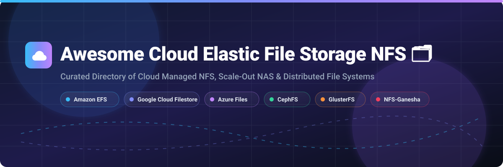

# Awesome-Cloud-Elastic-File-Storage-NFS 🗂️ ☁️

  

  
  
  
  
  
  

---

## 🌟 Top Cloud Elastic File Storage (NFS) Ecosystem

**Curated Directory of Commercial Elastic File Storage Platforms & Open-Source Distributed File Systems**  
*Focused on Serverless NFS, Scale-Out NAS, Multi-AZ Durability, POSIX Compliance & Self-Hosted Clustered Storage*

**Last updated: October 2026** 📅

---

### 📌 Overview & SEO Summary

Welcome to the ultimate curated directory of **cloud elastic file storage platforms**, **open-source distributed file systems**, and **scale-out NAS solutions**. Whether you are looking for enterprise-grade commercial solutions (such as *Amazon EFS*, *Google Cloud Filestore*, and *Azure Files*), or self-hostable open-source alternatives (like *Ceph*, *SeaweedFS*, *JuiceFS*, *GlusterFS*, and *NFS-Ganesha*), this list covers category leaders, POSIX-compliant clustering, high-throughput storage for AI/ML workloads, and privacy-respecting network file systems.

---

## 📑 Table of Contents

- [🏢 SaaS & Commercial Platforms](#-saas--commercial-platforms)
- [🔓 Open-Source GitHub Projects](#-open-source-github-projects)
- [🛠️ How to Contribute](#%EF%B8%8F-how-to-contribute)
- [📊 Star History](#-star-history)
- [🤝 Support & Sponsorship](#-support--sponsorship)
- [⚠️ Disclaimer](#%EF%B8%8F-disclaimer)

---

## 🏢 SaaS / Commercial Platforms

### 📈 Market Size & Structure Overview
> 💡 **Market Size & Dynamics**: The global Cloud Elastic File Storage (NFS & Scale-Out NAS) market is estimated at **$7.5 Billion – $9.2 Billion** in 2026, expanding at an **18.5%+ CAGR** fueled by enterprise AI workloads, cloud-native container storage, and HPC migrations. The sector is **highly concentrated**, dominated by cloud hyperscalers (AWS, Microsoft Azure, Google Cloud) offering serverless managed NFS platforms alongside enterprise NAS pioneers (NetApp, Pure Storage, WekaIO, Qumulo).

*Sorted by Company Market Cap / Valuation (Descending)* 💰

| SaaS / Commercial Platform | Company / Owner | Valuation / Market Cap | Standard Edition Starting Price | Free Tier / Free Trial Limits | Description |
| :--- | :--- | :--- | :--- | :--- | :--- |
| **[Azure Files](https://azure.microsoft.com/en-us/products/storage/files/)** 🔷 | Microsoft | ~$3.90 Trillion | **$0.06/GiB-month** (Standard HDD); **$0.15/GiB-month** (Premium SSD Provisioned v2) | **5 GB LRS Standard Hot storage / month for 12 months** (+ $200 free trial credits for 30 days) | **Azure-native enterprise file shares** — Supports **SMB and NFS v4.1**. Provisioned v2 separates capacity, IOPS, and throughput. Multi-region redundancy (LRS, ZRS, GRS, GZRS). |
| **[Amazon EFS](https://aws.amazon.com/efs/)** ☁️ | Amazon | ~$2.0 Trillion | **$0.30/GB-month** (Standard SSD); **$0.016/GB-month** (Infrequent Access); **$0.008/GB-month** (Archive) | **5 GB EFS Standard / month for 12 months** | **AWS-native serverless NFS** — Elastic throughput auto-scales without provisioning. Intelligent Lifecycle Tiering moves cold data to Archive (97% cost reduction). Sub-millisecond SSD latency. |
| **[Google Cloud Filestore](https://cloud.google.com/filestore)** 🌐 | Google (Alphabet) | ~$2.0 Trillion | **$0.16/GiB-month** (Basic HDD); **$0.30/GiB-month** (Basic SSD); **$0.0452/hour** baseline | **$300 free credits for 90 days** for new GCP accounts | **GCP-native managed NFS v3/v4.1** — Four performance tiers (Basic HDD/SSD, Zonal, Regional). Custom performance tuning enables independent IOPS & bandwidth scaling. |
| **[NetApp Cloud Volumes ONTAP](https://cloud.netapp.com/)** 🔵 | NetApp | ~$20 Billion | **$0.066/GB-month** (Standard); **$0.030/GB-month** (Edge Cache) | **30-day free trial** (up to 500 GB capacity) | **Enterprise NAS across AWS, Azure & GCP** — Full ONTAP feature set: deduplication, compression, snapshots, cloning, Autonomous Ransomware Protection, and tiering to object storage. |
| **[Pure Storage FlashBlade](https://www.purestorage.com/)** 🟣 | Pure Storage | ~$15 Billion | **$0.085/GiB-month** (Evergreen//One storage-as-a-service commitment) | **30-day free POC trial & interactive lab** | **Unified all-flash file & object storage** — NVMe scale-out architecture delivering >60 GB/s bandwidth. Optimized for AI/ML training & rapid cyber recovery. |
| **[WekaFS](https://www.weka.io/)** ⚡ | WekaIO | Private ($1.6 Billion) | **$0.07/GB-month** (AWS Marketplace pay-as-you-go backend instance licensing) | **14-day free trial on AWS/GCP Marketplace** | **Software-defined parallel file system** — Hardware-agnostic high-performance storage delivering tens of millions of IOPS and sub-300 microsecond latency for AI & HPC workloads. |
| **[Qumulo Cloud Q](https://qumulo.com/)** 📊 | Qumulo | Private ($1.2 Billion) | **$0.0263/TB-hour** ($19.23/TB-month PAYG hourly on AWS) | **30-day free trial on AWS Marketplace** (up to 1 TB) | **Cloud-native scale-out file storage** — Petabyte-scale file management with real-time data analytics, API-first control, and seamless multi-cloud replication. |
| **[Panzura CloudFS](https://panzura.com/)** 🦅 | Panzura | Private ($500 Million) | **$70.00/TB-month** ($840/year per TB for CloudFS NAS) | **30-day free trial & interactive sandbox** | **Global cloud file system with 60s RPO** — Immutable snapshots, AI ransomware protection, global deduplication, and multi-site SMB/NFS file locking. |
| **[CTERA File Cloud](https://www.ctera.com/)** 🏢 | CTERA | Private ($300 Million) | **$1,000/month** ($12,000/year starting platform license) | **30-day free evaluation license** (up to 10 edge filers) | **Edge-to-cloud file services platform** — Connects remote filers to cloud object storage with source-side deduplication (up to 90% data reduction) and FIPS 140-2 security. |
| **[SoftNAS](https://www.buurst.com/)** 🧈 | Buurst | Private ($50 Million) | **$0.25/hour per node** (vCPU performance-based tiering) | **30-day free trial on AWS / Azure / GCP Marketplace** | **Cloud NAS software with performance-based pricing** — Multi-protocol support (NFS, SMB, iSCSI) with ObjFast acceleration and 99.999% high availability. |

---

## 🔓 Open-Source GitHub Projects

*Sorted by GitHub Star Count (Descending)* 🌟

- **[SeaweedFS](https://github.com/seaweedfs/seaweedfs)**   
  **Fast distributed blob, object, and POSIX file system**, Apache-2.0 licensed. **Scales to billions of files with O(1) disk read efficiency**. **Supports FUSE mount, S3 API, WebDAV, and Hadoop HDFS**. **Built-in tiering to cloud object storage**. 🌊

- **[Ceph](https://github.com/ceph/ceph)**   
  **Unified distributed storage system (object, block, file)**, LGPL-2.1 / GPL-2.0 / BSD-3-Clause licensed. **CephFS** provides POSIX-compliant distributed file system. **RADOS** foundation with **erasure coding** for cost-efficient storage. **The dominant open-source storage platform** for cloud infrastructure and Kubernetes (via Rook). 🐙

- **[JuiceFS](https://github.com/juicedata/juicefs)**   
  **POSIX-compliant distributed file system built on top of Redis / SQL and Object Storage**, Apache-2.0 licensed. **Separates metadata engine from object data storage**. **Full POSIX compatibility, sub-millisecond metadata operations**, and native Kubernetes CSI driver. 🧃

- **[Rook](https://github.com/rook/rook)**   
  **Cloud-native storage orchestrator for Kubernetes**, Apache-2.0 licensed. **CNCF graduated project**. **Deploys and manages Ceph, NFS, and other storage systems** on Kubernetes. **Self-managing, self-scaling, self-healing** storage infrastructure. 🎛️

- **[OpenEBS](https://github.com/openebs/openebs)**   
  **Leading cloud-native Container Attached Storage (CAS)**, Apache-2.0 licensed. **CNCF project**. **Provides dynamic provisioning for Kubernetes block and local NFS file volumes**. **Lightweight, modular engine for stateful applications**. 🔌

- **[Longhorn](https://github.com/longhorn/longhorn)**   
  **Cloud-native distributed block & file storage for Kubernetes**, Apache-2.0 licensed. **100% open source, CNCF incubated project**. **Built-in incremental snapshots, backups, and cross-cluster disaster recovery**. 🐂

- **[KubeVirt](https://github.com/kubevirt/kubevirt)**   
  **Virtualization API & runtime for Kubernetes**, Apache-2.0 licensed. **Runs traditional VM workloads alongside containers**. **Leverages CephFS and NFS for persistent VM storage and live migration**. 🖥️

- **[CubeFS](https://github.com/cubefs/cubefs)**   
  **Cloud-native distributed storage system hosted by CNCF**, Apache-2.0 licensed. **Provides POSIX-compliant file system and S3-compatible object storage interface**. **Optimized for large-scale AI training, data lakes, and container applications**. 🧊

- **[GlusterFS](https://github.com/gluster/glusterfs)**   
  **Distributed scale-out file system capable of scaling to several petabytes**, GPL-2.0 / LGPL-3.0 licensed. **Aggregates storage bricks over TCP/IP into one parallel network file system**. **Supports FUSE, NFSv3, NFSv4, SMB, and libgfapi**. 🧱

- **[MooseFS](https://github.com/moosefs/moosefs)**   
  **Petabyte-scale POSIX-compliant distributed file system**, GPL-3.0 licensed. **Fault-tolerant network file system with metadata master servers and chunkservers**. **Widely used for media rendering, backup, and archival storage**. 📦

- **[NFS-Ganesha](https://github.com/nfs-ganesha/nfs-ganesha)**   
  **User-space NFS server supporting v3, v4, v4.1, v4.2**, LGPL-3.0 licensed. **The reference user-space NFS server for GlusterFS and CephFS**. **FSAL (File System Abstraction Layer) architecture** with pluggable storage backends. 🎯

- **[Ceph CSI](https://github.com/ceph/ceph-csi)**   
  **Container Storage Interface (CSI) plugin for Ceph**, Apache-2.0 licensed. **Enables Kubernetes to dynamically provision and manage CephFS and Ceph RBD volumes**. ☸️

- **[Sheepdog](https://github.com/sheepdog/sheepdog)**   
  **Distributed block and object storage system for QEMU/KVM**, GPL-2.0 licensed. **Provides highly available volume storage for virtualization infrastructure**. 🐑

- **[LizardFS](https://github.com/lizardfs/lizardfs)**   
  **Open-source software-defined distributed file system**, GPL-3.0 licensed. **MooseFS fork featuring enhanced replication, geo-replication, and web GUI management**. 🦎

---

## 🛠️ How to Contribute

Contributions are welcome! Follow these steps to submit new elastic file storage platforms or open-source distributed file system software:

1. 🍴 **Fork** the repository.
2. 📝 **Add/edit** entries in `README.md` maintaining table/list structure and formatting.
3. 🔗 Include project title, official website/GitHub link, exact star count, license, and brief description.
4. 🚀 Submit a **Pull Request** with a descriptive summary of your changes.

---

## 📊 Star History

---

## 🤝 Support & Sponsorship

If you find this cloud elastic file storage repository useful, please consider supporting the project:

- ⭐ **Star** this repository to increase visibility and help others discover it!
- 🔀 **Fork** and share with fellow storage engineers, DevOps practitioners, and open-source advocates.
- ☕ **Sponsor & Buy Me a Coffee**: Support ongoing open-source curation via the [GitHub Sponsor Dashboard](https://github.com/sponsors/ishandutta2007).

---

## ⚠️ Disclaimer

- This is a **community-curated** list — not exhaustive and not an endorsement. ℹ️
- **Cloud NFS pricing is complex** — EFS charges **per GB-month plus throughput**, Filestore separates **instance, capacity, and IOPS**, Azure Files provisioned v2 charges **storage, IOPS, and throughput separately**. **Model your actual usage patterns** before committing.
- **EFS Archive costs $0.008/GB-month** (US East) — up to **97% cheaper** than Standard, but retrieval is **milliseconds** and intended for data accessed **a few times a year or less**.
- **NetApp CVO add-on services add up quickly**: **Ransomware Protection $0.009/GB**, **Cloud Data Sense $0.0425/GB**, **WORM $0.018/GB**, **Cloud Backup $0.0425/GB** — plus **$0.001/10K reads** and **$0.01/10K writes**.
- **Pure Storage FlashBlade is premium-priced** — **$0.085/GiB-month** for Evergreen//One, with **32–45% discount depth** available. **Cyber-recovery (+20%)** and **snapshot (+15%)** are additional GiB charges.
- **Open-source solutions (Ceph, GlusterFS, SeaweedFS, JuiceFS) are not turnkey** — they require **operational expertise** for tuning, monitoring, and capacity planning. **Rook** simplifies Kubernetes deployment but adds operational surface area. **Test failover and recovery procedures** before production deployment.
- **WekaFS charges only for backend instances** — client instances (including r3 when installed as clients) are **free of charge**. This can significantly reduce costs in client-heavy workloads. 🗂️

---

  <b>Made with ❤️ for storage engineers, cloud architects, and open-source file system advocates.</b>

